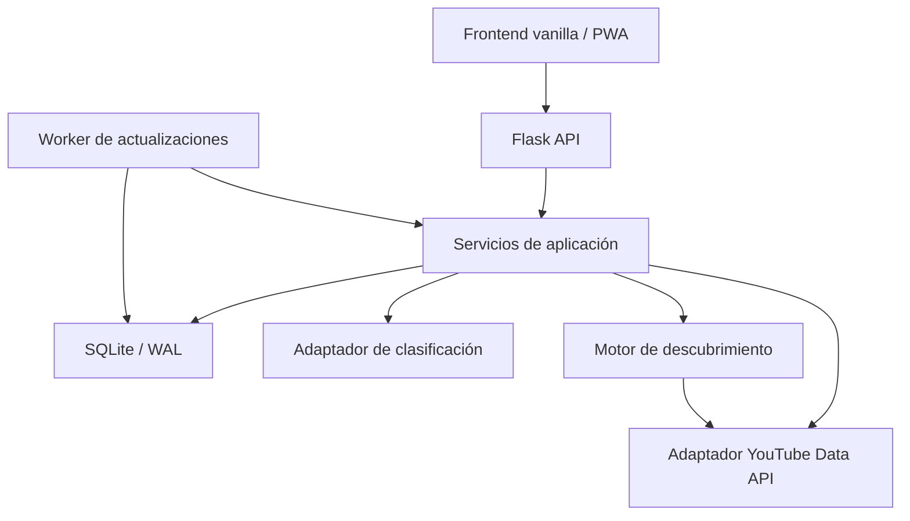

# Diseño técnico — YouTube Curator

## 1. Principios

1. La aplicación es un curador, no un reproductor.
2. Las decisiones del usuario prevalecen sobre cualquier automatización.
3. La actualización externa es manual, visible e idempotente.
4. Los descubrimientos deben poder explicarse.
5. El núcleo debe funcionar aunque fallen clasificación o descubrimiento.
6. El diseño debe permitir sustituir el clasificador sin cambiar el dominio.

## 2. Arquitectura



### 2.1 Frontend

- HTML semántico renderizado como shell.
- CSS propio, responsive y mobile first.
- JavaScript ES modules.
- `fetch` para consumir `/api/v1`.
- Estado de filtros reflejado en `URLSearchParams`.
- Componentes funcionales simples: tarjetas, filtros, modal de clasificación y estados de actualización.
- Sin framework ni acceso directo a datos persistentes.

### 2.2 Backend

Paquetes sugeridos:

```text
app/
  __init__.py
  config.py
  auth/
  api/
  domain/
  services/
  repositories/
  integrations/youtube/
  integrations/classifier/
  migrations/
  static/
  templates/
tests/
```

Responsabilidades:

- `api`: validación y serialización HTTP.
- `services`: casos de uso y transacciones.
- `repositories`: SQL y mapeo de entidades.
- `integrations`: clientes externos intercambiables.
- `domain`: reglas puras, puntuación y estados.

### 2.3 Worker

- Proceso Python separado, administrado por systemd.
- Consulta ejecuciones `pending` y reclama una mediante una actualización atómica.
- Mantiene `heartbeat_at` y `lease_expires_at`.
- Solo procesa trabajos creados por una acción explícita del usuario.
- Permite que Flask se reinicie sin perder el trabajo pendiente.
- No requiere Redis ni otro servicio para el alcance de un único usuario.

## 3. Autenticación

### 3.1 OAuth

- Flujo Authorization Code.
- Scopes de identidad: `openid email`.
- Único scope de YouTube: `https://www.googleapis.com/auth/youtube.readonly`.
- Validar `state`, emisor, audiencia y correo.
- Lista permitida mediante `OWNER_GOOGLE_EMAIL`.
- Guardar tokens cifrados en SQLite con una clave `TOKEN_ENCRYPTION_KEY` externa al repositorio y permisos de sistema restrictivos.
- Renovar access token mediante refresh token.

### 3.2 Sesión

- Cookie opaca de sesión.
- `HttpOnly`, `Secure`, `SameSite=Lax`.
- Rotación de sesión después de OAuth.
- CSRF token para `POST`, `PUT`, `PATCH` y `DELETE`.

## 4. Modelo de datos

### 4.1 Tablas

#### `channels`

| Campo | Tipo | Regla |
|---|---|---|
| `id` | INTEGER | PK |
| `youtube_channel_id` | TEXT | UNIQUE, nullable solo para casos futuros |
| `title` | TEXT | NOT NULL |
| `description` | TEXT | |
| `thumbnail_url` | TEXT | |
| `uploads_playlist_id` | TEXT | |
| `is_subscribed` | INTEGER | boolean |
| `is_locally_followed` | INTEGER | boolean |
| `is_blocked` | INTEGER | boolean |
| `created_at` | TEXT | ISO 8601 UTC |
| `updated_at` | TEXT | ISO 8601 UTC |

#### `categories`

| Campo | Tipo | Regla |
|---|---|---|
| `id` | INTEGER | PK |
| `name` | TEXT | NOT NULL |
| `normalized_name` | TEXT | UNIQUE |
| `description` | TEXT | |
| `position` | INTEGER | NOT NULL |
| `created_at` | TEXT | |
| `updated_at` | TEXT | |

#### `category_keywords`

| Campo | Tipo | Regla |
|---|---|---|
| `id` | INTEGER | PK |
| `category_id` | INTEGER | FK |
| `term` | TEXT | NOT NULL |
| `weight` | REAL | default 1 |
| `polarity` | TEXT | `positive` o `negative` |

#### `channel_categories`

| Campo | Tipo | Regla |
|---|---|---|
| `channel_id` | INTEGER | FK |
| `category_id` | INTEGER | FK |
| `source` | TEXT | `manual`, `automatic`, `accepted_suggestion` o `accepted_discovery` |
| `created_at` | TEXT | |

PK compuesta: `(channel_id, category_id)`.

#### `classification_suggestions`

| Campo | Tipo | Regla |
|---|---|---|
| `id` | INTEGER | PK |
| `channel_id` | INTEGER | FK |
| `category_id` | INTEGER | FK |
| `confidence` | REAL | 0..1 |
| `explanation` | TEXT | |
| `classifier_version` | TEXT | |
| `status` | TEXT | `pending`, `accepted`, `rejected`, `superseded` |
| `auto_applied` | INTEGER | boolean |
| `created_at` | TEXT | |
| `resolved_at` | TEXT | nullable |

#### `classification_decisions`

Registra decisiones manuales para evitar que futuras ejecuciones las pisen.

| Campo | Tipo |
|---|---|
| `channel_id` | INTEGER |
| `category_id` | INTEGER |
| `decision` | TEXT (`include`, `exclude`) |
| `updated_at` | TEXT |

PK compuesta: `(channel_id, category_id)`.

#### `videos`

| Campo | Tipo | Regla |
|---|---|---|
| `id` | INTEGER | PK |
| `youtube_video_id` | TEXT | UNIQUE |
| `channel_id` | INTEGER | FK |
| `title` | TEXT | NOT NULL |
| `description` | TEXT | |
| `published_at` | TEXT | indexado |
| `duration_seconds` | INTEGER | nullable |
| `thumbnail_url` | TEXT | |
| `content_type` | TEXT | `video`, `live`, `upcoming`, `unknown` |
| `created_at` | TEXT | |
| `updated_at` | TEXT | |

El origen no se persiste en `videos`: se calcula como `followed` cuando el canal está suscripto o seguido localmente, y como `discovery` cuando existe una asociación activa en `discovery_candidates`.

#### `discovery_candidates`

Permite que un mismo video sea candidato en varias categorías.

| Campo | Tipo | Regla |
|---|---|---|
| `video_id` | INTEGER | FK |
| `category_id` | INTEGER | FK |
| `score` | REAL | 0..100 |
| `reasons_json` | TEXT | JSON |
| `status` | TEXT | `active`, `hidden`, `accepted`, `expired` |
| `first_seen_at` | TEXT | |
| `last_seen_at` | TEXT | |

PK compuesta: `(video_id, category_id)`.

#### `video_user_state`

| Campo | Tipo |
|---|---|
| `video_id` | INTEGER PK/FK |
| `opened_at` | TEXT nullable |
| `open_count` | INTEGER |
| `watched` | INTEGER |
| `watched_source` | TEXT (`opened`, `manual`, `youtube_import`) |
| `updated_at` | TEXT |

`youtube_import` queda reservado para una integración futura concreta; no implica que el MVP pueda obtener historial completo.

#### `discovery_feedback`

| Campo | Tipo |
|---|---|
| `id` | INTEGER PK |
| `video_id` | INTEGER nullable |
| `channel_id` | INTEGER nullable |
| `category_id` | INTEGER |
| `action` | TEXT |
| `created_at` | TEXT |

Acciones: `more_like_this`, `less_like_this`, `hide_video`, `block_channel`, `accept_channel`.

#### `refresh_runs`

| Campo | Tipo |
|---|---|
| `id` | INTEGER PK |
| `status` | TEXT |
| `requested_stages_json` | TEXT |
| `current_stage` | TEXT |
| `requested_at` | TEXT |
| `started_at` | TEXT nullable |
| `finished_at` | TEXT nullable |
| `counters_json` | TEXT |
| `errors_json` | TEXT |
| `heartbeat_at` | TEXT nullable |
| `lease_expires_at` | TEXT nullable |
| `worker_id` | TEXT nullable |

### 4.2 Índices mínimos

- `videos(published_at DESC)`.
- `videos(channel_id, published_at DESC)`.
- `discovery_candidates(category_id, status, score DESC)`.
- `channel_categories(category_id, channel_id)`.
- `classification_suggestions(status, channel_id)`.
- `channels(is_subscribed, is_blocked)`.

## 5. Integración con YouTube

### 5.1 Importación

1. `subscriptions.list(mine=true, part=snippet,contentDetails, maxResults=50)`.
2. Paginar hasta agotar `nextPageToken`.
3. Consolidar identificadores.
4. Consultar metadatos de canales en lotes.
5. Obtener `relatedPlaylists.uploads`.
6. Aplicar cambios en transacción.

### 5.2 Videos de suscripciones y seguimientos locales

Para cada canal con `is_subscribed=true` o `is_locally_followed=true` y playlist de publicaciones:

1. Consultar primeros elementos de la playlist.
2. Detenerse cuando todos los elementos de una página sean conocidos y anteriores al último punto de sincronización, salvo reintento completo.
3. Obtener detalles de videos en lotes.
4. Hacer `upsert` por `youtube_video_id`.

### 5.3 Cuota y errores

- Encapsular todas las llamadas en `YouTubeGateway`.
- Reintentar errores transitorios con backoff limitado.
- No reintentar automáticamente errores de cuota o autorización.
- Registrar unidades estimadas por operación.
- Mostrar un error accionable sin exponer payloads sensibles.

### 5.4 Operaciones y presupuesto

| Necesidad | Operación preferida | Observación |
|---|---|---|
| Importar suscripciones | `subscriptions.list` | Paginar con `maxResults=50`. |
| Obtener playlist de publicaciones | `channels.list` | Consultar IDs en lotes. |
| Obtener publicaciones | `playlistItems.list` | Preferir sobre búsquedas por canal. |
| Hidratar duración y estado | `videos.list` | Consultar IDs en lotes. |
| Generar candidatos | `search.list` | Únicamente para descubrimiento. |

- `DISCOVERY_MAX_SEARCHES_PER_REFRESH` limita búsquedas totales.
- `DISCOVERY_MAX_SEARCHES_PER_CATEGORY` limita una categoría individual.
- El gateway debe devolver consumo estimado y respuesta de cuota.
- Los límites reales deben leerse de configuración; no codificar una cuota diaria como constante permanente.

## 6. Actualización manual

### 6.1 Etapas

```text
subscriptions
channels
followed_videos
classification
discovery
finalize
```

### 6.2 Ejecución

- `POST /refresh-runs` persiste una ejecución `pending` si no existe otra `pending` o `running`.
- El worker independiente reclama la ejecución y la cambia a `running`.
- El frontend consulta `GET /refresh-runs/{id}`.
- Cada etapa confirma sus cambios independientemente.
- Si una etapa falla, la ejecución termina `partial` o `failed` según los datos preservados.
- El worker renueva la lease durante cada etapa y marca la ejecución al finalizar.
- Al iniciar, el worker recupera trabajos cuya lease venció; todas las etapas deben ser idempotentes.
- Una restricción o índice parcial debe impedir más de una ejecución `pending` o `running`.

## 7. Clasificación

### 7.1 Entrada

```json
{
  "channel": {
    "title": "…",
    "description": "…"
  },
  "recentVideos": [
    {"title": "…", "description": "…"}
  ],
  "categories": [
    {"id": 1, "name": "Linux", "description": "…", "keywords": ["Debian"]}
  ]
}
```

### 7.2 Salida normalizada

```json
{
  "suggestions": [
    {
      "categoryId": 1,
      "confidence": 0.91,
      "explanation": "El canal publica principalmente tutoriales de Linux y Debian."
    }
  ]
}
```

### 7.3 Estrategia

Definir interfaz:

```python
class ChannelClassifier(Protocol):
    def classify(self, channel, recent_videos, categories) -> list[Suggestion]:
        ...
```

Implementaciones:

1. `KeywordClassifier`: obligatoria como fallback determinista.
2. `SemanticClassifier`: opcional, configurada mediante adaptador externo o modelo local.

Reglas:

- `>= CLASSIFY_AUTO_THRESHOLD` (predeterminado `0.85`): crear sugerencia, aplicar relación con fuente `automatic` y mostrarla para revisión.
- Entre `CLASSIFY_SUGGEST_THRESHOLD` (predeterminado `0.55`) y el umbral automático: crear sugerencia pendiente sin asignar.
- Debajo del umbral de sugerencia: no persistir sugerencia.
- Respetar siempre `classification_decisions`.
- Guardar versión del clasificador.
- Explicaciones máximas y sanitizadas.
- Aceptar una asignación automática cambia su fuente a `accepted_suggestion`.
- Rechazarla elimina únicamente la relación automática y crea decisión manual `exclude`.

## 8. Descubrimiento

### 8.1 Generación de candidatos

Por categoría:

1. Construir consultas a partir de palabras clave positivas.
2. Añadir términos frecuentes y distintivos de canales confirmados.
3. Añadir señales de los videos abiertos o marcados como vistos recientemente dentro de la categoría.
4. Limitar consultas mediante los presupuestos global y por categoría.
5. Buscar videos públicos.
6. Hidratar detalles de videos y canales.
7. Filtrar duplicados, bloqueos y exclusiones.

### 8.2 Puntuación inicial

Puntuación normalizada 0..100:

```text
 35 coincidencia con palabras clave
+ 25 similitud temática con canales semilla
+ 15 actualidad
+ 10 idioma preferido, si está configurado
+ 15 feedback positivo relacionado
+ 10 similitud con videos vistos recientemente
- 40 feedback negativo relacionado
-100 canal bloqueado o video oculto
```

La suma se normaliza a 0..100. La fórmula debe ser una función pura configurable y probada.

### 8.3 Explicación

Guardar dos o tres razones legibles:

```json
[
  "Coincide con «llama.cpp» y «Ollama».",
  "Temática similar a dos canales de IA local.",
  "Publicado recientemente."
]
```

### 8.4 Separación visual

- Los videos con origen `followed`, provenientes de canales suscriptos o seguidos localmente, ocupan el feed principal.
- Descubrimiento aparece en bloque separado.
- El filtro de procedencia puede mostrar solo uno de los dos conjuntos.
- Toda tarjeta de descubrimiento lleva una etiqueta explícita.

## 9. Consultas de feed

### 9.1 Vista Feed

Consulta base:

- join `videos` → `channels`;
- join opcional con `channel_categories`;
- left join `video_user_state`;
- left join `discovery_candidates` para el contexto de categoría;
- filtros en SQL;
- `ORDER BY published_at DESC, id DESC`;
- paginación por cursor recomendado: `(published_at, id)`.

El origen de respuesta se calcula con precedencia `followed` sobre `discovery`, evitando duplicar una tarjeta cuando un canal descubierto ya fue aceptado. `discoveryContexts` conserva todas las categorías aplicables cuando la consulta no está acotada a una sola.

### 9.2 Vista Por canal

- Seleccionar canales de la categoría.
- Para cada canal, obtener una cantidad limitada de videos.
- Evitar N+1 mediante window functions de SQLite o consulta agrupada.

## 10. Frontend

### 10.1 Rutas

- `/`: portada y categorías.
- `/category/:id`: categoría con vista y filtros en query string.
- `/channels`: gestión y clasificación.
- `/discoveries`: descubrimientos globales.
- `/settings`: conexión, bloqueos, exportación y diagnóstico.

Flask puede servir un único shell para las rutas del cliente.

### 10.2 Estado URL

Ejemplo:

```text
/category/4?view=feed&channels=12,18&watched=false&origin=followed
```

### 10.3 Diseño responsive

- Escritorio: barra lateral de categorías + área principal.
- Móvil: encabezado compacto + selector de categoría + panel inferior de filtros.
- Rejilla fluida de tarjetas.
- Vista por canal horizontal solo si mantiene accesibilidad táctil; de lo contrario, listas apiladas.

## 11. PWA

- `manifest.webmanifest`.
- Service worker con estrategia cache-first solo para assets versionados.
- Network-first para datos de API.
- Indicador explícito de desconexión.
- No permitir mutaciones offline durante el MVP.
- Abrir una URL HTTPS de YouTube puede derivar en la aplicación móvil de YouTube según la configuración del dispositivo; la PWA no controla ese comportamiento.

## 12. Observabilidad y respaldo

- Logs JSON con `request_id` y `refresh_run_id`.
- Métricas mínimas: duración por etapa, elementos creados/actualizados, fallos externos.
- Copia de seguridad consistente de SQLite.
- Exportación funcional independiente del backup técnico.

## 13. Decisiones pendientes configurables

No bloquear la implementación con estas decisiones:

- proveedor del clasificador semántico;
- cantidad exacta de videos recientes usados para clasificar;
- umbrales de confianza;
- límite de consultas de descubrimiento;
- idioma preferido.

Todas deben residir en configuración y contar con valores conservadores.

## 14. Limitaciones explícitas de YouTube

- La API no expone las recomendaciones personales de la portada; el descubrimiento es propio.
- La API no ofrece un indicador universal y estable para identificar Shorts. El MVP no promete ese filtro.
- La aplicación solo sabe que un video fue abierto o marcado; no conoce porcentaje reproducido.
- Los metadatos remotos pueden estar ausentes, cambiar o dejar de estar disponibles.

## 15. Referencias externas

- YouTube Data API v3: https://developers.google.com/youtube/v3/docs
- `subscriptions.list`: https://developers.google.com/youtube/v3/docs/subscriptions/list
- `playlistItems.list`: https://developers.google.com/youtube/v3/docs/playlistItems/list
- `videos.list`: https://developers.google.com/youtube/v3/docs/videos/list
- `search.list`: https://developers.google.com/youtube/v3/docs/search/list
- Políticas para desarrolladores: https://developers.google.com/youtube/terms/developer-policies
